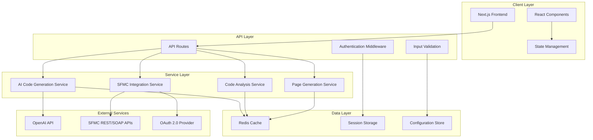

# Design Document

## Overview

The Syngenta SFMC Development Suite is a Next.js-based web application that provides AI-powered development tools for Salesforce Marketing Cloud developers. The suite integrates three core modules: AI Code Generator, Advanced Debugging Tool, and Cloud Pages Generator, all unified under a cohesive user interface with seamless SFMC integration capabilities.

The application follows a modular component architecture built on React/TypeScript with a modern UI framework, enabling developers to efficiently generate, debug, and deploy SFMC-compatible code across multiple languages including SQL, AMPScript, SSJS, CSS, and HTML.

## Architecture

### System Architecture



### Technology Stack

- **Frontend**: Next.js 14, React 18, TypeScript, Tailwind CSS
- **UI Components**: Radix UI primitives with custom styling
- **State Management**: React hooks with context for global state
- **API Layer**: Next.js API routes with middleware
- **Authentication**: OAuth 2.0 with JWT token management
- **AI Integration**: OpenAI GPT-4 API for code generation and analysis
- **SFMC Integration**: REST and SOAP API clients
- **Caching**: Redis for session and response caching
- **Deployment**: Docker containers with horizontal scaling support

## Components and Interfaces

### Core Components

#### 1. AI Code Generator Component
```typescript
interface AICodeGeneratorProps {
  initialPrompt?: string
  supportedLanguages: CodeLanguage[]
  conversationHistory: Message[]
}

interface Message {
  id: string
  role: "user" | "assistant"
  content: string
  image?: string
  timestamp: number
  metadata?: {
    language?: CodeLanguage
    codeBlocks?: CodeBlock[]
  }
}

interface CodeBlock {
  language: string
  code: string
  explanation?: string
}
```

#### 2. Advanced Debugging Tool Component
```typescript
interface DebuggingToolProps {
  supportedLanguages: DebugLanguage[]
  analysisDepth: "basic" | "advanced" | "comprehensive"
}

interface DebugAnalysis {
  errors: DebugError[]
  warnings: DebugWarning[]
  suggestions: OptimizationSuggestion[]
  performance: PerformanceMetrics
  bestPractices: BestPracticeViolation[]
}

interface DebugError {
  line: number
  column: number
  severity: "error" | "warning" | "info"
  message: string
  rule: string
  fixSuggestion?: string
}
```

#### 3. Cloud Pages Generator Component
```typescript
interface CloudPagesGeneratorProps {
  defaultConfiguration: PageConfiguration
  templateLibrary: PageTemplate[]
}

interface PageConfiguration {
  pageSettings: {
    pageName: string
    publishedURL: string
    pageType: PageType
  }
  codeResources: ResourceConfiguration
  advancedOptions: AdvancedOptions
}

interface GeneratedOutput {
  pages: GeneratedPage[]
  codeResources: CodeResource[]
  integrationNotes: string
  testingGuidelines: string
  deploymentInstructions: string
}
```

### API Interfaces

#### Code Generation API
```typescript
// POST /api/generate-code
interface CodeGenerationRequest {
  prompt: string
  language?: CodeLanguage
  image?: string
  conversationHistory: Message[]
  context?: SFMCContext
}

interface CodeGenerationResponse {
  response: string
  codeBlocks: CodeBlock[]
  suggestions: string[]
  executionTime: number
}
```

#### Debugging API
```typescript
// POST /api/debug-code
interface DebugRequest {
  code: string
  language: DebugLanguage
  analysisLevel: "syntax" | "performance" | "security" | "all"
  conversationHistory?: DebugMessage[]
}

interface DebugResponse {
  analysis: string
  errors: DebugError[]
  fixedCode?: string
  optimizations: OptimizationSuggestion[]
  performanceScore: number
}
```

#### SFMC Integration API
```typescript
// POST /api/sfmc/authenticate
interface SFMCAuthRequest {
  clientId: string
  clientSecret: string
  subdomain: string
}

interface SFMCAuthResponse {
  accessToken: string
  refreshToken: string
  expiresIn: number
  tokenType: string
}

// GET /api/sfmc/data-extensions
interface DataExtensionResponse {
  dataExtensions: DataExtension[]
  totalCount: number
}
```

### Service Layer Architecture

#### AI Service
```typescript
class AICodeGenerationService {
  async generateCode(request: CodeGenerationRequest): Promise<CodeGenerationResponse>
  async analyzeCode(code: string, language: string): Promise<AnalysisResult>
  async optimizeCode(code: string, language: string): Promise<OptimizationResult>
  private buildPrompt(request: CodeGenerationRequest): string
  private parseAIResponse(response: string): ParsedResponse
}
```

#### SFMC Integration Service
```typescript
class SFMCIntegrationService {
  async authenticate(credentials: SFMCCredentials): Promise<AuthResult>
  async refreshToken(refreshToken: string): Promise<AuthResult>
  async getDataExtensions(): Promise<DataExtension[]>
  async deployCloudPage(page: GeneratedPage): Promise<DeploymentResult>
  async validateAMPScript(code: string): Promise<ValidationResult>
  private handleRateLimit(): Promise<void>
  private retryWithBackoff<T>(operation: () => Promise<T>): Promise<T>
}
```

## Data Models

### User Session Model
```typescript
interface UserSession {
  sessionId: string
  userId?: string
  sfmcCredentials?: EncryptedCredentials
  preferences: UserPreferences
  conversationHistory: ConversationHistory
  createdAt: Date
  lastActivity: Date
  expiresAt: Date
}

interface UserPreferences {
  defaultLanguage: CodeLanguage
  debugLevel: DebugLevel
  theme: "light" | "dark" | "system"
  autoSave: boolean
  codeFormatting: FormattingOptions
}
```

### Code Analysis Model
```typescript
interface CodeAnalysisResult {
  id: string
  code: string
  language: CodeLanguage
  analysis: {
    syntaxErrors: SyntaxError[]
    semanticIssues: SemanticIssue[]
    performanceIssues: PerformanceIssue[]
    securityVulnerabilities: SecurityIssue[]
    bestPracticeViolations: BestPracticeViolation[]
  }
  suggestions: CodeSuggestion[]
  fixedCode?: string
  confidence: number
  processingTime: number
  createdAt: Date
}
```

### SFMC Integration Model
```typescript
interface SFMCConnection {
  connectionId: string
  subdomain: string
  clientId: string
  encryptedClientSecret: string
  accessToken?: string
  refreshToken?: string
  tokenExpiry?: Date
  connectionStatus: "active" | "expired" | "error"
  lastUsed: Date
  permissions: SFMCPermission[]
}

interface SFMCAsset {
  assetId: string
  name: string
  type: "cloudpage" | "email" | "coderesource" | "dataextension"
  content?: string
  metadata: Record<string, any>
  lastModified: Date
  createdBy: string
}
```

## Error Handling

### Error Classification System
```typescript
enum ErrorType {
  VALIDATION_ERROR = "VALIDATION_ERROR",
  AUTHENTICATION_ERROR = "AUTHENTICATION_ERROR", 
  SFMC_API_ERROR = "SFMC_API_ERROR",
  AI_SERVICE_ERROR = "AI_SERVICE_ERROR",
  RATE_LIMIT_ERROR = "RATE_LIMIT_ERROR",
  INTERNAL_SERVER_ERROR = "INTERNAL_SERVER_ERROR"
}

interface ApplicationError {
  type: ErrorType
  message: string
  code: string
  details?: Record<string, any>
  timestamp: Date
  requestId: string
  userId?: string
}
```

### Error Handling Strategy
- **Client-side**: React Error Boundaries with user-friendly error messages
- **API Layer**: Centralized error middleware with structured error responses
- **Service Layer**: Retry logic with exponential backoff for transient failures
- **SFMC Integration**: Specific handling for rate limits and authentication errors
- **AI Services**: Fallback mechanisms for service unavailability

### Retry and Circuit Breaker Patterns
```typescript
class CircuitBreaker {
  private failureCount = 0
  private lastFailureTime?: Date
  private state: "CLOSED" | "OPEN" | "HALF_OPEN" = "CLOSED"
  
  async execute<T>(operation: () => Promise<T>): Promise<T>
  private shouldAttempt(): boolean
  private onSuccess(): void
  private onFailure(): void
}
```

## Testing Strategy

### Testing Pyramid

#### Unit Tests (70%)
- **Component Testing**: React Testing Library for UI components
- **Service Testing**: Jest for business logic and API services
- **Utility Testing**: Pure function testing for helpers and utilities
- **Mock Strategy**: Mock external APIs and services

#### Integration Tests (20%)
- **API Integration**: Test API routes with real database connections
- **SFMC Integration**: Test SFMC API interactions with sandbox environment
- **AI Service Integration**: Test AI service responses with mock data
- **Authentication Flow**: End-to-end authentication testing

#### End-to-End Tests (10%)
- **User Workflows**: Playwright for critical user journeys
- **Cross-browser Testing**: Chrome, Firefox, Safari compatibility
- **Performance Testing**: Load testing for concurrent users
- **Accessibility Testing**: WCAG compliance verification

### Test Data Management
```typescript
interface TestDataFactory {
  createMockUser(): UserSession
  createMockSFMCConnection(): SFMCConnection
  createMockCodeAnalysis(): CodeAnalysisResult
  createMockAIResponse(): CodeGenerationResponse
}

class TestEnvironmentSetup {
  async setupTestDatabase(): Promise<void>
  async seedTestData(): Promise<void>
  async cleanupTestData(): Promise<void>
  async mockExternalServices(): Promise<void>
}
```

### Performance Testing Strategy
- **Load Testing**: Simulate 100+ concurrent users
- **Stress Testing**: Test system limits and failure points
- **AI Response Time**: Ensure <2 second response times
- **Memory Usage**: Monitor for memory leaks in long sessions
- **Database Performance**: Query optimization and indexing

### Security Testing
- **Authentication Testing**: OAuth flow security validation
- **Input Validation**: SQL injection and XSS prevention
- **Token Security**: JWT token validation and expiry
- **SFMC Credential Protection**: Encryption and secure storage
- **Rate Limiting**: API abuse prevention testing

### Continuous Integration Pipeline
```yaml
# .github/workflows/ci.yml
name: CI/CD Pipeline
on: [push, pull_request]
jobs:
  test:
    runs-on: ubuntu-latest
    steps:
      - name: Unit Tests
        run: npm run test:unit
      - name: Integration Tests  
        run: npm run test:integration
      - name: E2E Tests
        run: npm run test:e2e
      - name: Security Scan
        run: npm audit && npm run security:scan
      - name: Performance Tests
        run: npm run test:performance
```

This design provides a robust, scalable architecture that addresses all requirements while maintaining code quality, security, and performance standards. The modular approach allows for independent development and testing of each component while ensuring seamless integration across the entire suite.