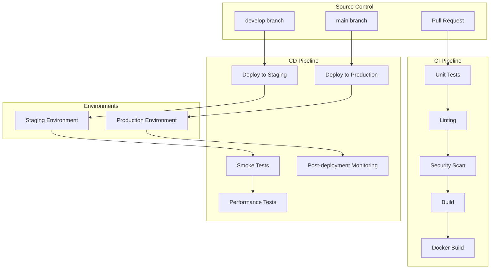

# CI/CD Pipeline Documentation

This document describes the Continuous Integration and Continuous Deployment (CI/CD) pipeline for the SFMC Development Suite.

## Table of Contents

1. [Overview](#overview)
2. [Pipeline Architecture](#pipeline-architecture)
3. [Workflows](#workflows)
4. [Environment Setup](#environment-setup)
5. [Deployment Process](#deployment-process)
6. [Monitoring and Rollback](#monitoring-and-rollback)
7. [Security](#security)
8. [Troubleshooting](#troubleshooting)

## Overview

The CI/CD pipeline is built using GitHub Actions and provides:

- **Continuous Integration**: Automated testing, security scanning, and code quality checks
- **Continuous Deployment**: Automated deployment to staging and production environments
- **Performance Testing**: Automated load, stress, and spike testing
- **Security Scanning**: Regular vulnerability assessments
- **Rollback Capabilities**: Automated rollback on deployment failures

## Pipeline Architecture



## Workflows

### 1. Continuous Integration (`ci.yml`)

**Triggers:**
- Push to `main` or `develop` branches
- Pull requests to `main` or `develop` branches

**Jobs:**
1. **Test Job**
   - Runs unit tests with coverage
   - Runs integration tests
   - Uploads coverage reports to Codecov

2. **Security Job**
   - NPM security audit
   - Snyk vulnerability scanning
   - Dependency security checks

3. **Build Job**
   - Builds the Next.js application
   - Uploads build artifacts

4. **Docker Build Job**
   - Builds Docker image
   - Pushes to GitHub Container Registry
   - Runs Trivy security scan on image

### 2. Staging Deployment (`cd-staging.yml`)

**Triggers:**
- Push to `develop` branch
- Manual workflow dispatch

**Jobs:**
1. **Deploy to Staging**
   - Builds staging Docker image
   - Deploys to Kubernetes staging environment
   - Runs smoke tests
   - Runs performance tests

2. **Rollback on Failure**
   - Automatically rolls back if deployment fails
   - Notifies team via Slack

### 3. Production Deployment (`cd-production.yml`)

**Triggers:**
- Push to `main` branch
- Git tags (releases)
- Manual workflow dispatch (with confirmation)

**Jobs:**
1. **Pre-deployment Checks**
   - Verifies staging tests passed
   - Runs final security scan
   - Requires manual confirmation for manual triggers

2. **Deploy to Production**
   - Creates deployment backup
   - Builds production Docker image
   - Deploys using blue-green strategy
   - Runs comprehensive health checks

3. **Post-deployment Monitoring**
   - Monitors deployment for 10 minutes
   - Checks for failing pods
   - Validates health endpoints

4. **Rollback on Failure**
   - Automatically rolls back if deployment fails
   - Restores previous version
   - Notifies team

### 4. Performance Testing (`performance-tests.yml`)

**Triggers:**
- Daily schedule (2 AM UTC)
- Manual workflow dispatch

**Tests:**
- Load testing (normal traffic simulation)
- Stress testing (high load scenarios)
- Spike testing (sudden traffic spikes)

### 5. Security Scanning (`security-scan.yml`)

**Triggers:**
- Weekly schedule (Monday 3 AM UTC)
- Push to main branch (dependency changes)
- Manual workflow dispatch

**Scans:**
- Dependency vulnerabilities
- Container image vulnerabilities
- Static code analysis (CodeQL)
- Secrets detection (TruffleHog)

## Environment Setup

### Required Secrets

Configure the following secrets in your GitHub repository:

#### General Secrets
- `GITHUB_TOKEN`: Automatically provided by GitHub
- `CODECOV_TOKEN`: For code coverage reporting
- `SNYK_TOKEN`: For Snyk security scanning
- `SLACK_WEBHOOK`: For deployment notifications

#### Staging Environment
- `STAGING_KUBECONFIG`: Base64-encoded kubeconfig for staging cluster

#### Production Environment
- `PRODUCTION_KUBECONFIG`: Base64-encoded kubeconfig for production cluster

### Environment Variables

Each environment should have its own configuration:

#### Staging
```yaml
environment: staging
variables:
  NODE_ENV: staging
  REDIS_URL: redis://redis-staging:6379
  LOG_LEVEL: info
```

#### Production
```yaml
environment: production
variables:
  NODE_ENV: production
  REDIS_URL: redis://redis-production:6379
  LOG_LEVEL: warn
```

## Deployment Process

### Staging Deployment

1. **Trigger**: Push to `develop` branch
2. **Build**: Create staging Docker image
3. **Deploy**: Update Kubernetes deployment
4. **Test**: Run smoke tests and performance tests
5. **Notify**: Send deployment status to Slack

### Production Deployment

1. **Pre-checks**: Verify staging success and run security scans
2. **Confirmation**: Manual approval for workflow_dispatch triggers
3. **Backup**: Create deployment backup
4. **Deploy**: Blue-green deployment to production
5. **Monitor**: 10-minute monitoring period
6. **Notify**: Send deployment status to team

### Blue-Green Deployment Strategy

The production deployment uses a blue-green strategy:

1. **Current Version (Blue)**: Currently serving traffic
2. **New Version (Green)**: New deployment being rolled out
3. **Health Checks**: Verify green deployment health
4. **Traffic Switch**: Gradually switch traffic to green
5. **Monitoring**: Monitor green deployment
6. **Rollback**: Switch back to blue if issues detected

## Monitoring and Rollback

### Health Checks

The pipeline includes multiple health check levels:

1. **Startup Probe**: Ensures application starts successfully
2. **Liveness Probe**: Monitors application health
3. **Readiness Probe**: Checks if application can serve traffic
4. **Custom Health Checks**: Application-specific health validation

### Automatic Rollback Triggers

Rollback is triggered automatically when:

- Health checks fail after deployment
- Error rate exceeds threshold (>5%)
- Response time exceeds threshold (>5s for 95th percentile)
- Pod crash loops detected
- Manual rollback requested

### Rollback Process

1. **Detection**: Monitoring detects failure
2. **Rollback**: Kubernetes rollout undo to previous version
3. **Verification**: Health checks on rolled-back version
4. **Notification**: Team notification with failure details

## Security

### Security Scanning

The pipeline includes multiple security layers:

1. **Dependency Scanning**: NPM audit and Snyk
2. **Container Scanning**: Trivy vulnerability scanner
3. **Code Analysis**: CodeQL static analysis
4. **Secrets Detection**: TruffleHog for exposed secrets

### Security Thresholds

- **Critical vulnerabilities**: Block deployment
- **High vulnerabilities**: Require review
- **Medium vulnerabilities**: Generate warnings
- **Low vulnerabilities**: Informational only

### Secret Management

- All secrets stored in GitHub Secrets
- Environment-specific secret isolation
- Regular secret rotation recommended
- No secrets in code or configuration files

## Troubleshooting

### Common Issues

#### 1. Build Failures

**Symptoms:**
- CI pipeline fails at build stage
- TypeScript compilation errors
- Missing dependencies

**Solutions:**
```bash
# Check build logs
gh run view <run-id> --log

# Test build locally
npm run build

# Check dependencies
npm audit
npm ci
```

#### 2. Test Failures

**Symptoms:**
- Unit tests failing
- Integration tests timing out
- Coverage below threshold

**Solutions:**
```bash
# Run tests locally
npm test
npm run test:integration

# Check test coverage
npm run test:coverage

# Debug specific test
npm test -- --testNamePattern="specific test"
```

#### 3. Deployment Failures

**Symptoms:**
- Kubernetes deployment fails
- Pods in CrashLoopBackOff
- Health checks failing

**Solutions:**
```bash
# Check deployment status
kubectl get deployments -n sfmc-development-suite

# Check pod logs
kubectl logs -l app=sfmc-dev-suite -n sfmc-development-suite

# Check events
kubectl get events -n sfmc-development-suite --sort-by='.lastTimestamp'

# Manual rollback
kubectl rollout undo deployment/sfmc-dev-suite-deployment -n sfmc-development-suite
```

#### 4. Performance Test Failures

**Symptoms:**
- High response times
- Error rate above threshold
- Memory or CPU issues

**Solutions:**
```bash
# Check resource usage
kubectl top pods -n sfmc-development-suite

# Scale deployment
kubectl scale deployment sfmc-dev-suite-deployment --replicas=5 -n sfmc-development-suite

# Check HPA status
kubectl get hpa -n sfmc-development-suite
```

### Debug Commands

#### GitHub Actions
```bash
# List workflow runs
gh run list

# View specific run
gh run view <run-id>

# Download artifacts
gh run download <run-id>

# Re-run failed jobs
gh run rerun <run-id> --failed
```

#### Kubernetes
```bash
# Check deployment status
kubectl rollout status deployment/sfmc-dev-suite-deployment -n sfmc-development-suite

# Get deployment history
kubectl rollout history deployment/sfmc-dev-suite-deployment -n sfmc-development-suite

# Scale deployment
kubectl scale deployment sfmc-dev-suite-deployment --replicas=3 -n sfmc-development-suite
```

### Performance Optimization

#### CI Pipeline Optimization
- Use dependency caching
- Parallel job execution
- Artifact reuse between jobs
- Conditional job execution

#### Deployment Optimization
- Use rolling updates
- Configure resource limits
- Enable horizontal pod autoscaling
- Use readiness/liveness probes

### Monitoring and Alerting

#### Key Metrics to Monitor
- Deployment success rate
- Build duration
- Test coverage
- Security scan results
- Performance test results

#### Alerting Setup
- Slack notifications for failures
- Email alerts for security issues
- Dashboard for deployment metrics
- Log aggregation for troubleshooting

For additional support, check the GitHub Actions logs and Kubernetes events for detailed error information.